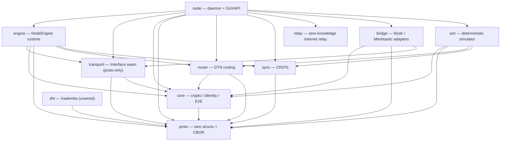
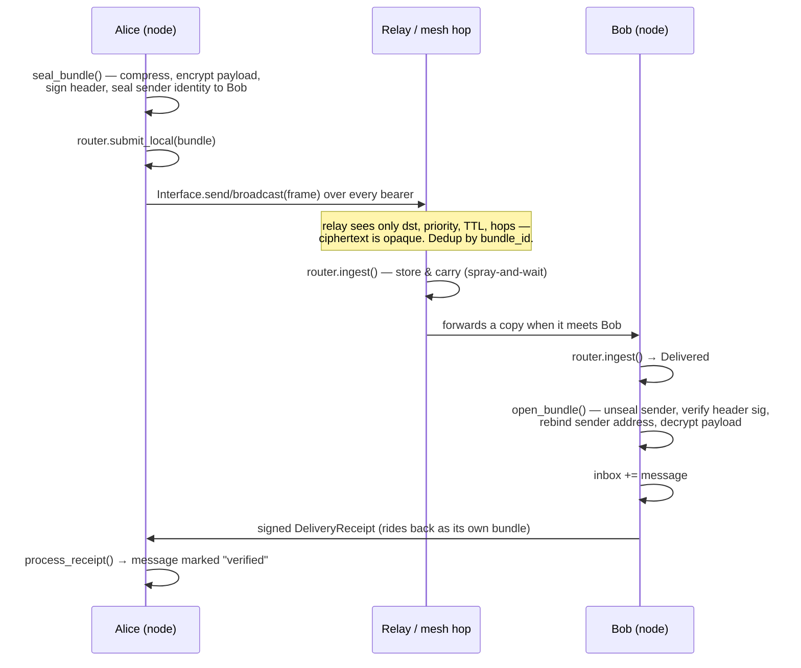

# Project Lifeline — Architecture

> A decentralized, offline-first, end-to-end-encrypted emergency mesh messenger,
> written in Rust. This document explains **how the system is put together** —
> the layers, the crates, the extension seams, and how a message actually flows
> from one phone to another with no cell network, no servers, and no accounts.

If you are brand new to the *product*, read the [Field Guide](docs/) first for the
"why". This document is the "how", for engineers.

---

## 1. The one-paragraph model

A **message** is sealed end-to-end into an opaque **bundle** and handed to
whatever **bearers** (radios, LAN, internet relays, the Nostr network, a
Meshtastic mesh…) happen to be in range. Every node is also a **router**: it
stores bundles it can't yet deliver and forwards copies opportunistically when it
meets other nodes (**store–carry–forward**, the delay-tolerant-networking model).
Bundles carry only routing metadata in the clear; the payload is decryptable only
by the recipient. Delivery is **eventually-consistent** and **verifiable** (signed
delivery receipts). No component is load-bearing for the network to function —
remove the internet, the relays, even most of the mesh, and messages still move.

---

## 2. Layer model → crates

Lifeline is a classic layered stack. Each layer is one (or part of one) Cargo
crate, and **each boundary between layers is a narrow trait or data contract** —
that is the whole extensibility story.

| Layer | Responsibility | Crate(s) |
|------:|----------------|----------|
| **L6 App** | Web GUI + HTTP/WS API, the daemon, config, persistence | `node` |
| **L5 Sync** | CRDTs for eventually-consistent shared state (contacts, read state) | `sync` |
| **L4 Routing** | DTN store–carry–forward: spray-and-wait (pluggable policy), priority, custody, gateways, reputation | `router` |
| **L3 Engine** | The runtime that composes L1–L5: sessions, discovery, groups, onion, blocks, gateways | `engine` (`NodeEngine`) |
| **L2 Crypto** | Identity, sealed-sender E2E, forward-secret prekeys, groups, onion, receipts | `core` |
| **L1/L0 Transport** | The bearer seam + framing/fragmentation + lossy-link ARQ | `transport` (`Interface`), `relay`, `bridge` |
| **L—  Wire** | Versioned wire structs + canonical CBOR codec (no crypto, no I/O) | `proto` |
| **Discovery** | Kademlia DHT for online peer/rendezvous lookup (library; wiring pending) | `dht` |
| **Test harness** | Deterministic multi-node simulator for acceptance tests | `sim` |

The `NodeEngine` runtime lives in its own `engine` crate, separate from the
lightweight `transport` **seam** — so `transport` depends only on `proto`
(+`core` for its error type), and implementing a new bearer never drags in the
router, CRDTs, or runtime. `engine` depends downward on transport/router/sync/
core; nothing below depends on it.

### Crate dependency graph



`proto` is the leaf everything shares; the `transport` seam sits just above it.
`relay` is standalone (it only speaks the wire format over TCP). Dependencies
never form a cycle.

---

## 3. The extension seams (the important part)

Almost every "add capability X" task in Lifeline is **implement one trait** or
**add one enum variant**. These are the seams, smallest-surface first:

### 3.1 `Interface` — the bearer seam (L1)
`transport::Interface` is how the engine talks to *any* medium. Five methods:
`caps()`, `scan()`, `send(peer, frame)`, `broadcast(frame)`, `poll()`. It is
**synchronous and object-safe** (`Box<dyn Interface>`), so the engine drives a
BLE radio, a UDP socket, and an internet relay through the identical interface
and never learns which is which. Async networks are quarantined behind it (see
§6).

### 3.2 `ExternalNet` + `BridgeInterface` — the "other networks" seam
`transport::ExternalNet` (four methods: `caps`/`publish`/`receive`/`peers`) is a
higher-level convenience: implement it and wrap in `BridgeInterface<N>` to get a
full `Interface` for free. This is how Lifeline rides **existing networks** it
wants to *augment* rather than replace:
- `bridge::nostr` — carries bundles as real signed NIP-01 events over the global
  Nostr relay network.
- `bridge::meshtastic` — carries bundles as real Meshtastic `MeshPacket` protobuf
  over MQTT, so Lifeline rides physical LoRa hardware.
- `bridge::skeleton` — a documented, compiling template for the next network.

### 3.3 `MeshBus` — transport-under-adapter seam
`bridge::meshtastic::MeshBus` abstracts the actual MQTT I/O so the Meshtastic
codec is testable against an in-memory broker with no network. Same pattern the
Nostr adapter uses with its `MockRelay`.

### 3.4 `DhtRpc` — the discovery request/response seam
`dht::DhtRpc` (`query(from, to, msg) -> Option<reply>`) lets the Kademlia lookup
algorithm run over *any* request/response carrier, and is what makes the DHT
fully testable against an in-memory network. (Binding it to a live bearer — which
needs a request/response layer over one-way frames — is pending; see roadmap.)

### 3.5 Data contracts that evolve safely
- `proto::PayloadKind` — add a message type by appending an enum variant; unknown
  variants decode to `Unknown` and are ignored, so a new type never partitions
  the network (see §5).
- `proto::Bundle` — add an **optional** field; CBOR's name-keyed maps +
  `skip_serializing_if` make it forward- and backward-compatible with no version
  bump.

> **Design note:** there is deliberately **no `SecureChannel` trait** abstracting
> the E2E cipher. A sealed box is stateless; a real ratchet is a stateful session
> — they don't share a signature, so a fake seam would only mislead. Forward
> secrecy comes from rotating the recipient *prekey* fed to the sealed box
> (`core::prekey`), which is the DTN-appropriate design.

---

## 4. Message lifecycle (data flow)

What actually happens when Alice messages Bob:



Key properties enforced along that path:
- **Sealed sender:** the sender's signature lives *inside* the recipient-sealed
  envelope, so a relay with a suspect list can't trial-verify who sent it.
- **Signed immutable header:** relays may mutate `hops`/`copies_left` (excluded
  from the signature); everything else is authenticated end-to-end.
- **Dedup + TTL + hop limit + spray budget:** bound flooding and memory.
- **Priority:** `SOS > Alert > Normal > Bulk`, honored at every hop; SOS bypasses
  bandwidth hold-back and postage.

---

## 5. Wire protocol & evolution policy

`proto` is the on-the-wire contract: versioned structs + canonical CBOR, **no
crypto, no I/O**. Evolution is designed so a heterogeneous-version mesh keeps
working (`proto::WIRE_VERSION`, currently **2**):

- **Additive optional fields** → no version bump. CBOR encodes structs as
  name-keyed maps; unknown keys are ignored, missing optional keys default.
- **New enum values** (`Priority`, `PayloadKind`) → no version bump. Both encode
  as **integer discriminants** and decode unknown values to a safe fallback:
  unknown `Priority` → `Bulk` (still relayed, never preempts — critical because
  it rides in the cleartext header every hop parses); unknown `PayloadKind` →
  `Unknown` (the engine ignores it). A new class rolls out gradually.
- **Structurally incompatible header change** → bump `WIRE_VERSION`.
  `DtnRouter::ingest` **rejects** a bundle whose version it doesn't accept, rather
  than mis-parsing it.

The codec is hardened for untrusted input: `from_cbor` runs an **iterative
structural pre-scan** bounding document size (16 MiB) and nesting depth (128)
before handing bytes to `ciborium` (which has no recursion limit) — closing
allocation-bomb and stack-overflow DoS vectors.

---

## 6. Concurrency & threading model

The core is deliberately **synchronous and single-owner**; async lives only at
the edges. This avoids `Arc<Mutex>`-everywhere and await-point reasoning in the
stateful heart of the system.

```
            ┌─────────────────────────── tokio runtime (node) ──────────────────────────┐
            │  axum HTTP/WS API           Nostr WS client tasks (per relay, reconnect)   │
            └──────┬───────────────────────────────┬────────────────────────────────────┘
   Command (mpsc)  │                                │ std↔tokio bridge (nostr_bridge)
                   ▼                                ▼
        ┌──────────────────────────── lifeline-engine OS thread ─────────────────────────┐
        │  loop { drain commands → engine.tick(now) → publish Snapshot → sleep(150ms) }   │
        │  owns NodeEngine (all mesh state); interfaces are Box<dyn Interface>            │
        └──────────┬───────────────────────────────┬────────────────────────────────────┘
       Snapshot    │ Arc<Mutex<Snapshot>>+version   │ ChannelInterface / BridgeInterface (std mpsc)
                   ▼                                ▼
              browser UI                      relay client (blocking OS threads), UDP, Meshtastic
```

- The **engine** runs one OS thread, ticking ~every 150 ms. It owns all mutable
  mesh state; nothing else touches it.
- The **API** sends `Command`s in (unbounded mpsc) and reads a published
  `Snapshot` out (`Arc<Mutex>` + version counter) — a CQRS-style split.
- **Synchronous bearers** (relay TCP, UDP, Meshtastic-MQTT) plug straight into
  the engine tick.
- **Asynchronous bearers** (Nostr WebSocket) run as tokio tasks and are bridged
  to the engine's std channels by `node::nostr_bridge`. (A reusable
  `AsyncExternalNet` helper to make this a one-liner is on the roadmap.)

---

## 7. Security model (summary)

Full detail lives in the crypto modules and the [security review](GAPS.md); the
shape:

- **Identity = key.** Address is `blake3(ed25519_pub)[..16]`. No registrar, phone
  number, or email. Private keys never leave the device unencrypted.
- **E2E:** X25519 ECDH → HKDF-SHA256 → XChaCha20-Poly1305 sealed box, with the
  bundle id bound as associated data. BLAKE3 for ids/links; Argon2id for the
  at-rest vault.
- **Sealed sender:** the true sender is encrypted to the recipient; relays see
  only the destination.
- **Forward secrecy (DTN-appropriate):** rotating signed **prekeys** — a sender
  seals to the recipient's current prekey, and old prekey secrets are pruned, so
  a later key seizure can't open past messages. Chosen over a Double Ratchet,
  which breaks under multi-day reordering.
- **Groups:** sender-keys (one symmetric ratchet per sender), each op bound to the
  E2E-authenticated sender to stop impersonation.
- **Onion routing:** optional layered sealing so relays learn only the next hop.
- **Anti-abuse:** Hashcash-style PoW "postage" gates Normal/Bulk admission (SOS
  exempt); black-hole **reputation/attribution** routes around nodes that take
  custody but never deliver; every parser is bounded against floods/bombs.

---

## 8. Extending Lifeline — recipes

### Add a new transport bearer
1. `impl ExternalNet for MyNet` (or `impl Interface` directly for full control).
2. Wrap: `BridgeInterface::new(my_net)`.
3. `engine.add_interface(Box::new(...))` — **nothing in `core`/`router`/engine
   changes.** For an async network, drive a `ChannelInterface` from your task
   (see `node::nostr_bridge`). Start from `bridge::skeleton`.

### Add a new message/payload type
1. Append a variant to `proto::PayloadKind` with a fresh discriminant.
2. Construct it where you originate the message.
3. Add its arm to the engine's **exhaustive** inbound `match` (the compiler
   forces you to — there is no wildcard). Old nodes decode it as `Unknown` and
   ignore it.

### Add a new routing strategy
Implement `router::RoutingPolicy` (`decide(&OfferContext) -> OfferAction`) and
pass it to `DtnRouter::with_policy`. The router owns the *mechanism* (candidate
iteration, copy-budget mutation, stats); your policy is a pure decision function
fed scalar context. The default `SprayAndWaitPolicy` is the reference; epidemic /
PRoPHET / Reticulum-style strategies drop in without touching the router.

---

## 9. Persistence & configuration

- **State** (identity, contacts, message history, prekey ring) is sealed by
  `core::vault` (Argon2id) and written **crash-safely** (temp file + atomic
  rename), so a mid-write crash never truncates the store. A **graceful shutdown**
  path (SIGTERM/Ctrl-C → final flush → join engine thread) protects a freshly
  rotated prekey ring.
- **Config** is via `LIFELINE_*` environment variables (node address, relay,
  passphrase, gateway/custodian role, and per-bearer settings). Consolidating
  these into one typed, validated `NodeConfig` is a roadmap item.

---

## 10. Testing architecture

- Unit tests live beside each module; crypto/codec/router/CRDT invariants
  (commutativity, idempotence, convergence, forward-compat, attack-resistance)
  are asserted directly.
- **`sim`** is a deterministic multi-node world used for the **acceptance test**
  (≥95% delivery across a partitioned 3-cluster + mule topology). It drives the
  *same* `DtnRouter` and CRDT core as the real node.
- Every network seam has a mock (`MockRelay`, `MockBroker`, in-memory DHT `Net`),
  so end-to-end paths are testable with no external network.

> **Caveat (roadmap):** `sim` re-implements the *orchestration* around the shared
> router and has drifted from `NodeEngine` (it lacks custody, attribution,
> bearer-caps). Unifying them so the sim exercises the real delivery pipeline is
> a roadmap item.

---

## 11. Repository map

```
crates/
  proto/      wire structs + CBOR codec + base64url + PoW           (leaf)
  core/       identity, crypto, message, prekey, group, onion,      (E2E/security)
              receipt, content, erasure, vault, log, alert, domain
  router/     DtnRouter, BundleStore, gateway, reputation,          (DTN routing)
              attribution, bounded sets
  sync/       version vectors, ORSWOT, LWW, SharedState             (CRDTs)
  transport/  Interface + ChannelInterface + BridgeInterface,       (bearer seam,
              frame/fragment, ARQ, caps, UDP                         proto-only)
  engine/     NodeEngine — composes transport+router+sync+core       (node runtime)
  bridge/     nostr, meshtastic, ws (live Nostr client), skeleton   (external nets)
  dht/        Kademlia routing table + iterative lookups            (discovery lib)
  relay/      zero-knowledge internet relay (ciphertext only)       (infra)
  sim/        deterministic multi-node simulator                    (test harness)
  node/       daemon: engine thread, HTTP/WS API, GUI, config       (application)
docs/         PRD, integration strategy, component reference, field guide
STATUS.md · GAPS.md · INTEROP.md · CHANGELOG.md · ARCHITECTURE.md (this file)
```

---

## 12. Known limitations & roadmap

These are tracked openly (they came out of an independent architecture review).
Ordered by structural impact:

1. **Decompose `NodeEngine`** — now isolated in its own `engine` crate (the
   layering split is done), the ~1,600-line, ~20-concern god object still wants
   breaking into per-concern services (`GroupService`, `ContentService`,
   `OnionService`, `CustodyService`, `GatewayService`, `PrekeyService`,
   `RetryService`) driven by `tick()`.
2. **Wire the DHT into the live node** via a request/response-over-frames layer
   (or a dedicated DHT thread), and give `Contact.endpoint` real meaning.
3. **Unify `sim` and `NodeEngine`** delivery pipelines so the acceptance test
   exercises custody/attribution/bearer-caps, not a simpler node than ships.
4. **Scale hygiene:** bound message history, move engine→UI to an event-driven
   `watch` channel, and design a **delta-sync** seam so the full CRDT state isn't
   retransmitted every tick.
5. **Typed `NodeConfig`** replacing ad-hoc env parsing, with validation + logging.
6. **Real radio backends** (BLE / ultrasound / LoRa-serial) behind the existing
   `Interface` seam — hardware-gated.

**Already delivered** from this review: the `transport`/`engine` **crate split**
(fixing the layering inversion), a pluggable **`RoutingPolicy`** trait, a reusable
**async-bearer** helper, forward-compatible wire enums + version gate, exhaustive
payload dispatch, crash-safe persistence + graceful shutdown, bounded CBOR
decoder, removal of the vestigial `SecureChannel`, `Zeroizing` key derivation, and
a centralized domain-separation registry.
